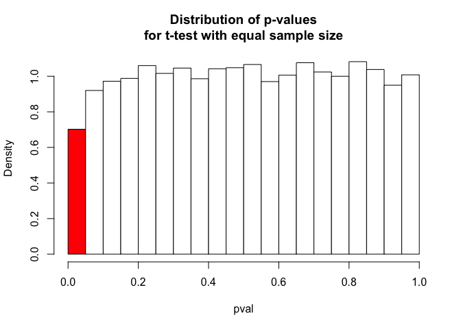
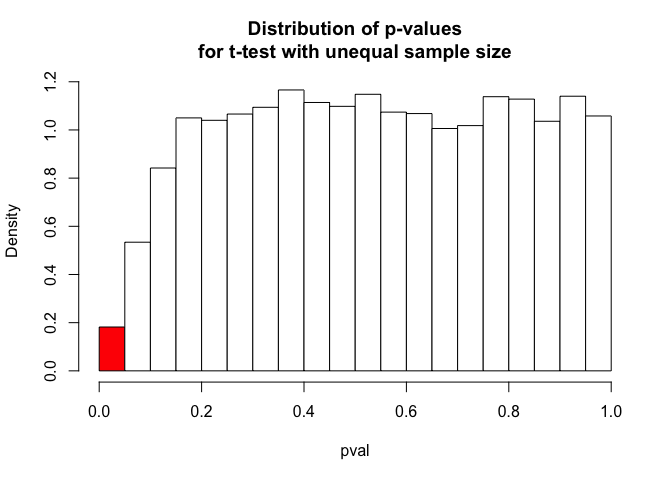

P\_value Validation and Simulation
================
Evan YF W.
2018-05-28

One way to verify p\_value's stability & performance - Simulation
=================================================================

One question being asked previously is how we evaluate the efficacy of p-value, which means how do we further confirm the provided p-value is capable to statistically reject or not reject one null hypothesis - Here I suggest one way, simulation, and demo a simple case to demostrate how this approach could verify p\_value. Find the following steps for your reference - \# T-test with equal sample sizes Let's take t-test as the example to see what p-value represents here - give the following histogram, you can see the red-labeled parts indicating the probability of when p-value &lt;=0.05, which is 0.04(0.8/20). There is 4% of chance that p-value will be equal or less than 0.05, representating the the prob of Type I error as well. Here we can see 4% is somewhat closer to what we expect on the significance level, 0.05 - so, this equal sample size t-test is somewhat fair.

``` r
rep <- 1e4
mu1 <- 5
mu2 <- 5
sigma <- 2
n1 <- 10
n2 <- 10
tval <- numeric(rep)
pval <- numeric(rep)

for(i in 1 :rep){
  x1 <- rnorm(n1, mu1, sigma)
  x2 <- rnorm(n2, mu2, sigma)
  S <- sqrt(((n1 - 1) * var(x1) + (n2 - 1) * var(x2)) / (n1 + n2 - 2))
  tval[i] <- (mean(x1) - mean(x2)) / (S * sqrt(1 / n1 + 1 / n2))
  pval[i] <- 2 * pt(abs(tval[i]), df = min(n1, n2) - 1, lower = FALSE)
}
hist(pval, freq = FALSE, breaks = seq(0, 1, 0.05), col = c("red", rep("white", 19)),
     main = "Distribution of p-values\nfor t-test with equal sample size")
```



T-test with unequal sample sizes
================================

Here we simulate the results of t-test under the condition with 2 unequal sample sizes, and we would like to see how it could affect the performance of p-value - From the follwing plot about the distribution of simulated p-values for t-test with this case, one can find that given the p-value less or equal than 0.05, the probability would be roughly around 0.005(0.1/20). Based on the ideal scenario, if a null hypothesis is being not rejected, the probability of p-value &lt;= 0.05 should be also around 0.05. In other words, the probability of p-value &lt;= 0.05 is the one of Type I error(Null hypothesis is correct but being rejected). Thus, our results showed this unequal sample size approach does lower the chance of Type I error, at the same time, increase the chance of Type II error theorically(cause alternative hypothesis is being verified, we tend to fail to reject hull hypothesis).

``` r
rep <- 1e4
mu1 <- 5
mu2 <- 5
sigma <- 2
n1 <- 5
n2 <- 50
tval <- numeric(rep)
pval <- numeric(rep)

for(i in 1 :rep){
  x1 <- rnorm(n1, mu1, sigma)
  x2 <- rnorm(n2, mu2, sigma)
  S <- sqrt(((n1 - 1) * var(x1) + (n2 - 1) * var(x2)) / (n1 + n2 - 2))
  tval[i] <- (mean(x1) - mean(x2)) / (S * sqrt(1 / n1 + 1 / n2))
  pval[i] <- 2 * pt(abs(tval[i]), df = min(n1, n2) - 1, lower = FALSE)
}
hist(pval, freq = FALSE, breaks = seq(0, 1, 0.05), col = c("red", rep("white", 19)),
     main = "Distribution of p-values\nfor t-test with unequal sample size")
```



Conclusion
==========

Ideally, we wish to see that the probability of p-value &lt;= 0.05 given the simulation should be somewhat close to 0.05, like the results we get from t-test with equal sample size. But we can see that the one with unequal sample size shows more conservative results by the simulation, higher the chance of Type II error and lower the chance of Type I error.
